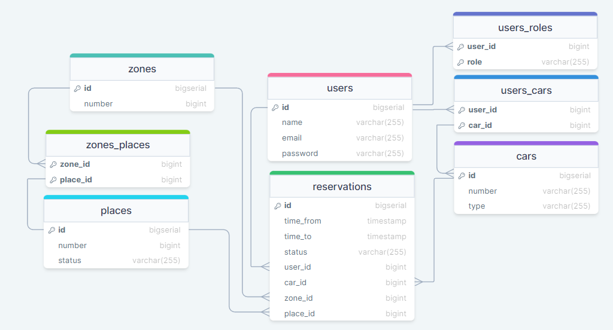

# Parking Reservation System Monolithic Project

Welcome to the Parking Reservation System project. This project serves as the
backend for a full-stack
parking application, offering features such as real-time reservation, user
management etc. Built using **Spring Boot (v3.1.4)**, the system
ensures robustness and scalability.

You can access Swagger and see all available endpoints by
visiting `http://localhost:8080/swagger-ui/index.html`

## Table of contents

1. [Overview](#overview)
2. [Sequence Diagram](#sequence-diagram)
3. [Database schema](#database-schema)
4. [Technologies Used](#technologies-used)
5. [Environment variables](#environment-variables)
6. [Setup](#setup)

## Overview

The Parking Reservation System is a cutting-edge solution designed to optimize
parking management processes and enhance user convenience. Built upon a
monolithic architecture, this system offers a robust and scalable backend for a
comprehensive parking application.

In this project, the emphasis is on providing a seamless and efficient
experience for both administrators and users. Through the integration of Spring
Boot (v3.1.4), the system delivers a powerful foundation for handling various
aspects of parking reservation, allocation, and tracking.

By leveraging the monolithic architecture, the Parking Reservation System aims
to streamline parking operations, minimize congestion, and optimize resource
utilization. With its user-friendly interface and robust backend infrastructure,
the system empowers stakeholders to efficiently manage parking spaces while
providing a seamless experience for end-users.

## Sequence Diagram

## Database Schema

## Technologies Used

**Spring Boot, Spring Security, JWT (JSON Web Tokens), Docker, PostgreSQL, Liquibase, GraphQL**

## Environment Variables

- `POSTGRES_USER` - Username for accessing PostgreSQL.
- `POSTGRES_PASSWORD` - Password for accessing PostgreSQL.
- `POSTGRES_DATABASE` - Name of the related database
- `POSTGRES_SCHEMA` - Name of the related schema
- `PGADMIN_DEFAULT_EMAIL` - Default email address for PGAdmin.
- `PGADMIN_DEFAULT_PASSWORD` - Default password for PGAdmin.

You can use example `.env.example` file with some predefined environments.

## Setup

You can find how to run this project locally or by Docker here (in production)
